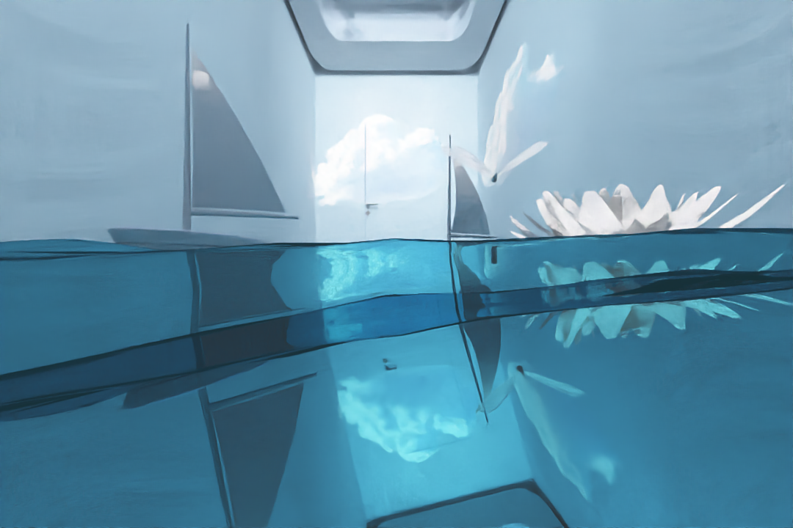

# Pooled Core Scene Rendering Project

- github：git@github.com:yuehuarulian/Tongji-24-GL.git

## 渲染结果：



## 运行：
建议运行方式：

- 在线渲染：
  - 请选择分支 realtime_scene
  - ./build/main > output.txt

- 离线渲染：
  - 请选择分支 main 或者 scene
  - ./build/offline_rendering > output.txt

如果运行失败调试策略：1/电脑重启; 2/选择注释掉房间/蝴蝶/点云/水/物理世界；3/调节fluid_config.json的scale参数（建议1.0-2.0之间）

备注：在线渲染刚开始水的位置不对是正常的，这是因为第一帧水还在计算中，稍事等待即可，如果想加快水速度可以调小fluid_config.json的scale参数。

## 相机操作：

- A：左移
- S：下移
- D：右移
- W：上移
- 摁住鼠标右键拖拽：转换视角
- 滚轮：前后移动

万向节死锁现象只是简单的限制了一下角度可能有点奇怪那里

## 代码规范

- 所有的 class 名称大写并使用驼峰命名法
- 所有函数，变量，文件名，请不要使用驼峰，下划线分割！！！
- task文件夹下所有具体类请用命名空间GL_TASK
- 类里面的函数之间需要空一格，变量不需要
- 注意不同模块用命名空间区分，防止撞名
- 参考如下

```C++
namespace fluid {
    class FluidSimulator {
    public:
        FluidSimulator(double scale = 0.2);

        void BindMesh(Mesh* const pMesh);

        void reset();
    
        void pause();
    
        void advance();

        vec3d get_grid_offset() const;
    
        vec3s get_grid_size() const;
    
        vec3d get_grid_center() const;
    
        double get_cell_size() const;
    
        vec3d get_min_corner() const;
    
        vec3d get_max_corner() const;

        std::vector<simulation::particle> get_particles();
    
        mesher::mesh_t get_mesh_t();
    
        grid3<std::size_t> get_grid_occupation();
    
        grid3<vec3d> get_grid_velocities();
    
        mesher::mesh_t get_room_mesh_t() const;

        void save_mesh_to_obj(std::string const& path = "mesh.obj");
    
        void save_points_to_txt(const std::string& filepath = "points.txt");

        void wait_until_next_frame();

    private:
        LoadModel roomModel;

        vec3d sim_grid_offset;
        vec3s sim_grid_size;
        vec3d sim_grid_center;
        double sim_cell_size;
        simulation::method sim_method;
        double sim_blending_factor;
        vec3d sim_gravity;
        double sim_dt;

        obstacle roomObstacle;

        bool FinSignal{ false };
        std::thread sim_thread;
        std::thread mesh_thread;

        bool isMeshBound;
        Mesh *pMesh;

        std::mutex sim_particles_lock;
        std::vector<simulation::particle> sim_particles;
        std::mutex sim_mesh_lock;
        mesher::mesh_t sim_mesh;
        grid3<std::size_t> sim_grid_occupation;
        grid3<vec3d> sim_grid_velocities;
        bool sim_mesh_valid = false;
        semaphore sim_mesher_sema;

        std::atomic_bool
            sim_paused = false,
            sim_reset = true,
            sim_advance = false;

        void update_simulation(const simulation& sim);
    
        void reset_simulation(simulation& sim);
    
        void simulation_thread();
    
        void mesher_thread();
    
        int updateBoundMesh();
    };
}
```
