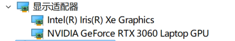

相机操作：
- A：左移
- S：下移
- D：右移
- W：上移
- 摁住鼠标右键拖拽：转换视角
- 滚轮：前后移动

可能写的不太好，不是很符合平常大家玩游戏的时候那种感觉，万向节死锁现象只是简单的限制了一下角度可能优点奇怪那里

我将在这里对光线追踪实现的原理以及相应的进度进行简要的说明

RTX 系列显卡支持计算光线追踪的核心技术是 **RT 核心（Ray Tracing Cores）** 和 **Tensor 核心（Tensor Cores）**，这些硬件加速单元使得实时光线追踪在游戏和图形渲染中成为可能。

我本身笔记本电脑的集成显卡和独立显卡型号如下：

### **RT 核心（Ray Tracing Cores）**

RT 核心是 NVIDIA 在 RTX 显卡中引入的专门用于加速光线追踪计算的硬件单元。RT 核心的设计目标是高效执行与光线追踪相关的算法，特别是在 **光线与物体相交的计算** 和 **BVH（Bounding Volume Hierarchy）加速结构** 的构建和遍历。

- **光线相交计算**：当光线追踪算法执行时，需要大量的计算来确定光线是否与场景中的物体相交，或者光线是否被反射、折射或阻挡。RT 核心通过专门的硬件加速这些复杂的计算过程，提高了光线追踪的效率。

- **加速 BVH 遍历**：BVH 是一种加速数据结构，用于减少光线与场景中所有物体之间的交点计算。RT 核心帮助加速 BVH 的遍历过程，使得在复杂场景中光线追踪的效率大大提高。

- **实时光线追踪**：通过硬件加速的 BVH 构建和光线相交测试，RTX 显卡能够实时渲染高质量的光线追踪效果，如反射、阴影、全局光照和折射等。

###  **Tensor 核心（Tensor Cores）**

Tensor 核心是 NVIDIA 为加速深度学习任务而设计的硬件单元，在 RTX 显卡中也被用来加速光线追踪相关的 **AI 技术**。例如，NVIDIA 在光线追踪渲染中引入了 **DLSS（Deep Learning Super Sampling）** 技术，Tensor 核心在其中扮演了关键角色。

- **DLSS（深度学习超采样）**：DLSS 使用深度学习算法通过低分辨率渲染图像并通过 AI 技术对图像进行重建，从而达到高分辨率图像的效果。Tensor 核心利用其高效的矩阵运算能力加速神经网络的推理过程，使 DLSS 能够在实时渲染中大幅提升性能，特别是在启用了光线追踪的场景中。
- **AI 加速的降噪**：在光线追踪的渲染过程中，通常会出现噪点，特别是在反射和折射等效果中。Tensor 核心可以加速 AI 降噪算法，这些算法可以有效去除噪点，提高最终图像的质量。

### **支持的 API 和框架**

- **NVIDIA RTX 和 Vulkan**： Vulkan 是支持光线追踪的现代图形 API，允许开发者利用 RTX 显卡的 RT 核心进行硬件加速的光线追踪计算。Vulkan 1.2 和后续版本引入了光线追踪扩展（Vulkan Ray Tracing Extensions），使开发者能够更加直接地利用 RTX 显卡的硬件特性。
- **NVIDIA OptiX**： OptiX 是 NVIDIA 提供的一个光线追踪加速库，它可以利用 RTX 显卡的 RT 核心来加速光线追踪计算。OptiX 提供了用于光线追踪的高效 API，可以处理场景中的光线相交、加速结构的构建与遍历等操作。
- **DirectX Raytracing (DXR)**： DXR 是 Microsoft 提供的光线追踪 API，集成在 DirectX 12 中，专为支持光线追踪的显卡（如 RTX 系列）设计。DXR 利用 RT 核心加速光线与物体的相交计算，并提供了在实时渲染中使用光线追踪的能力。
